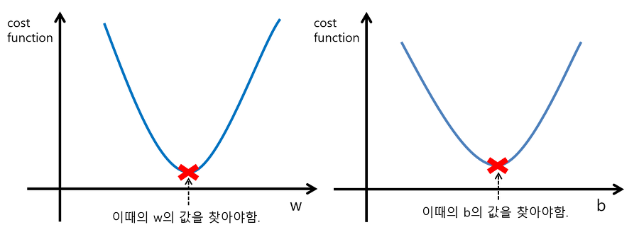
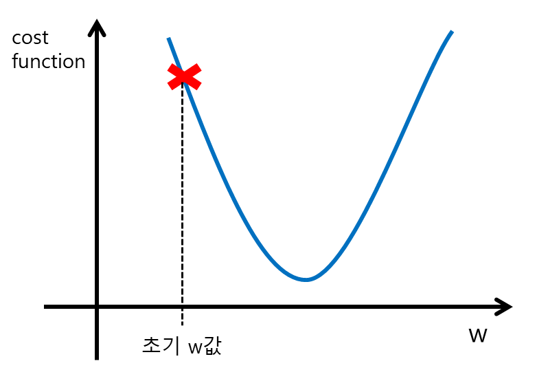

### 머신러닝

스팸 메일을 판정

그림에서 얼굴을 찾아냄

온라인 쇼핑몰 상품 추천

여태 할 수 없었던 일을 할 수 있게된 사례는 많지만 뭐든지 할 수 있는건 아니다.

응용할 곳은 많지만 만능은 아니다. 어디에 적용할 수 있고, 무엇을 할 수 있고, 할 수 없는지를 이해하는 것도 중요.

### 머신러닝의 중요성

머신러닝의 기초 이론이나 알고리즘 자체는 새로운 것이 아님.

반복처리를 잘하는 컴퓨터를 이용해 많은 데이터를 읽어 들이고 그 데이터 안의 특징을 학습해 패턴을 찾아내는 작업을 인간보다 효율적으로 처리한다. 이런 작업을 머신러닝 혹은 패턴인식이라고 말함.

이런 작업을 컴퓨터에게 맡기려는 생각은 옛날부터 많이 해왔고 연구도 많이 하고 구현해놓은 것도 있음

지금은 할 수 있는 일이 더 많다.

과거와의 차이점

- 데이터를 대량으로 수집할 수 있는 환경이 갖춰짐
  - 인터넷이 발전하면서 개인의 활동이나 생활의 일부가 디지털 쪽으로 옮겨짐 -> 데이터 양이 방대해짐.
  - 웹사이트 접근 로그, 블로그의 글과 사진, 메일 송신 이력, 온라인 쇼핑몰 구매 이력 등등.. -> 데이터 종류가 다양해짐.
- 데이터를 대량으로 처리할 수 있는 환경이 갖춰짐

머신러닝 자체가 데이터로부터 특징이나 패턴을 찾아내는 것이기때문에 데이터가 가장 먼저 필요하다.

얼굴 인식 기능 - SNS에서 인물 태그와 함께 게재된 이미지 데이터 사용

상품 추천 기능 - 온라인 쇼핑몰에 기록된 구매 이력 사용

컴퓨터 성능 향상

- 같은 양의 데이터를 처리하는 시간이 빨라짐.

  - 많이 학습할 수 있음

  - 처리가 빠름

    수치 계산을 GPU에 맡기거나 하둡, 스파크 같은 분산처리 기술도 발달해서 데이터를 대량으로 처리할 수 있는 환경이 만들어짐.

기술이 이제 이론을 따라잡고 있음. 머신러닝에 대한 관심이 커짐. 생활의 편의성을 위한 앱, 사업상에서 인간의 의사결정을 보조. 의료나 금융, 보안 분야 등등 다양한 영역에 응용 가능.

### 머신러닝 알고리즘

머신러닝이 잘할 수 있는 작업

- 회귀(Regression)
- 분류(Classification)
- 클러스터링(Clustering)

**회귀**

시계열 데이터(시간적인 변화를 연속적으로 관측한 데이터. ex. 증권시장의 주가.) 같은 연속된 데이터를 취급할 때 사용하는 기법.

연속된 데이터의 추세를 학습해 이후 추세를 찾아내는 작업 - 회귀를 사용한 머신러닝의 일종.

주가 예측의 경우 과거의 주가에만 영향을 받는 것이 아님. 따라서 과거 주가 데이터만으로는 예측 불가. 무언가를 예측하려면 그것에 영향을 줄 수 있는 데이터를 모아서 조합할 때가 많음.

**분류**

스팸메일 판정 - 메일의 내용과 그 메일이 스팸인지 아닌지를 구분한 데이터를 기반으로 학습. 학습 전에 학습 데이터에 스팸 여부를 표시해야 하기 때문에 귀찮음. 머신러닝에서 가장 힘든 작업은 데이터를 모으는 일. 아직 인간이 개입해야 할 부분은 많다.

분류 대상이 2개 - 2진분류 - ex) 스팸 여부, 사진으로 남녀 구분

분류 대상이 3개이상 - 다항분류 - ex) 숫자 인식 0~9까지로 분류 - 손글씨 숫자가 적힌 이미지와 그 이미지가 실제로 어느 숫자인지를 알려 주는 데이터를 모아 놓은 'MNIST' 데이터셋

**클러스터링(군집화)**

분류와 비슷하지만 다름.  회귀와 분류는 정답 데이터(레이블)를 가지고있음. 클러스터링은 레이블이 붙어 있지 않음. 그룹을 나누는 개념.

회귀, 분류 - 지도학습

클러스터링 - 비지도학습

언어 - 머신러닝에서는 파이썬이나 R 언어 등이 사용되고있음(다른 언어로도 구현할 수는 있지만 파이썬이나 R은 머신러닝을 위한 풍부한 라이브러리가 마련돼 있어서 사용하기 편리함.)

### 회귀

#### 1. 평균제곱오차(Mean Squared Error)

##### 비용함수란?

> 성능의 '나쁨'을 나타내는 지표로, 현재 신경망이 훈련데이터를 얼마나 잘 처리하지 못하느냐를 나타냄.

##### 비용함수를 사용하는 이유?

> 궁극적인 목표는 높은 '정확도'를 끌어내는 매개변수 값을 찾는 것.
>
> 그럼 왜 '정확도' 자체를 사용하지 않고 비용함수라는 우회적인 방법을 사용할까?
>
> 정확도를 지표로 삼으면 미분값이 대부분의 장소에서 0이 되어 매개변수를 갱신할 수 없다.
>
> 비용함수에서 미분이란 '가중치 매개변수의 값을 아주 조금 변화시켰을 때, 비용 함수가 어떻게 변하냐' 이다.
>
> 이부분은 (https://eehoeskrap.tistory.com/145)을 참조해보자.. 이해는 안가지만

학습 데이터가 n개 있다고 가정하면 학습 데이터마다 생기는 오차의 합은 다음 수식으로 나타낼 수 있다.
$$
MSE = \frac 1 n \displaystyle \sum_{(i=1)}^n(y^{(i)} - \hat y^{(i)})^2 \\
\hat y^{(i)} = wx_i+b \\
x^{(i)} 나\ y^{(i)} 는\ i번째\ 학습\ 데이터의 라벨값을,\ \hat y^{(i)}는\ 데이터\ 포인트의\ 예측값을\ 의미한다.\\
오차에\ 양수와\ 음수가\ 공존할\ 경우\ 합할\ 때\ 상쇄가\ 돼서\ 실제\ 오차가\ 줄어들어서\ 나올\ 것이다.\\
따라서\ (y^{(i)} - \hat y^{(i)})\ 를\ 제곱해준다.\\
절대값이\ 아닌\ 제곱을\ 사용하는\ 이유는\ 나중에\ 목적함수를\ 미분해야\ 하는데,\\
절대값보다는\ 제곱이\ 미분하기\ 쉽기\ 때문이다.\\
\frac 1 n를\ 곱한\ 이유도\ 나중에\ 미분과\ 관련된\ 식을\ 간단하게\ 만들기\ 위함이다.
$$
각각의 학습 데이터마다 z생기는 오차를 제곱해 더한 후 2로 나누었다. 이 E(θ)를 가장 작아지게 하는 θ를 찾는 것이 목적이고, 이를 최적화 문제라고 한다.

#### 2. 경사하강법(Gradient descent)

이제 머신러닝을 통해 위에서 배운 평균제곱오차를 최적화한다는 것을 알았다. 그렇다면 최적화 시켜주는 θ를 어떻게 찾아낼까?

θ 값을 일일히 적당히 수정하면서 이전의 오차와 비교하는 것은 힘든 작업이다. 그래서 사용하는 방법이 **미분**이다.

기계의 입장에서는 손실함수의 값이 최소가 되게 하는 w와 b를 찾아야 한다.

실제값과 예측값의 차이를 최소화시키는 w와 b를 찾으라는 것이므로 합리적인 생각이다.

w와 b에 대한 비용함수는 아래 그림과 같이 아래로 볼록한 2차함수형태가 된다.

그 이유는 MSE 공식을 w와 b에 대해서 정리해보면 알 수 있다.
$$
MSE = \frac 1 n \sum_{i=1}^n(y_i-\hat y_i)^2 \\
= \frac 1 n \{(y_1-wx_1-b)^2+\cdots+(y_n-wx_n-b)^2\} \\
= \frac 1 n \{(x_1^2+\cdots+x_n^2)w^2+\star\}\ \ \ \ \ \ \ \ \ (for\ \ w) \\
= \frac 1 n \{nb^2+\blacksquare\}\ \ \ \ \ \ \ \ \ (for\ \ b) \\
...(손실함수를 w와 b에 대해 정리한 것)
$$
위처럼 w와 b에 대한 이차함수로 정의될 수 있음을 확인했다. 기계는 손실함수 값이 최소가 되는 w와 b의 값을 찾아야 한다. 어떻게 찾을 수 있을까? 최적의 w값 혹은 b값을 찾는 과정을 살펴보자.

우선 임의로 w값을 하나 설정한다(초기값 부여).

운이 아주 좋으면 최적의 값이겠지만 그렇지 않을 확률이 훨씬 더 크다.

아마 아래 그림과 같이 최적의 w값과는 거리가 먼 것이 설정될 것이다.

**최적의 w값을 찾아가기 위해서 비용함수를 w에 대해서 편미분(매개변수가 2개이기 때문) 해준 것에 학습률(learning rate)이라고 불리는 파라미터 α 를 곱한 것을 초기 설정된 w값에서 빼준다.** 이상의 내용을 식으로 나타내면 아래 공식와 같다.
$$
w := w\ -\ \alpha\frac \partial {\partial w}MSE \\
A:=B\ \rightarrow\ A를\ B에\ 따라\ 정의한다.
$$
이때 학습률 파라미터는 적절한 값으로 사용자가 설정해줘야한다. 학습률이 너무 작으면 최적의 w를 찾아가는데 너무 오래 걸릴 가능성이 크고, 너무 크면 최적의 지점을 건너뛰어 버리고 발산해버릴 수도 있다.  

비용함수를 w에 대해 편미분하면 현재 w 위치에서 접선의 기울기와 같다. 이 예제에서는 음수값을 갖는다. 학습률은 양수인 실수이므로 원래 w값에서 어떤 크기의 음수만큼 빼주게 된다. 즉, 더하게 된다. 결국 w값이 커진다(오른쪽으로 이동). 새롭게 갱신된 w에 대해서 이 공식2의 과정을 반복하면 최적의 w값을 찾을 수 있게 된다.

<figure>
  
  <figcaption style="text-align: center;">그림 4. 경사하강법</figcaption>
</figure> 

이것이 바로 경사하강법이다. 왜냐하면 점차 접선의 경사가 감소하기 때문이다. 접선의 기울기의 절대값이 0이 될때가 최적의 w값이 된다. 

최적의 b값을 찾아가는 것도 이와 동일하다.
$$
b := b\ -\ \alpha\frac \partial {\partial b}MSE
$$
그림4와 비슷한 과정을 통해서 결국은 최적의 b값을 찾아갈 것이다.

이렇게 최적의 w와 b를 찾아가는 과정을 어묵판매량-기온 그래프에서 살펴보면 아래 그림과 같다.

초기값으로 설정된 w와 b를 갖는 일차함수식은 데이터를 제대로 반영하지 못한다.

그러나 위의 두 공식을 반복하면서 w와 b의 값이 최적값에 가까워지면서 점차 나은 결과를 얻는다. 결국은 우리가 원했던 결과를 도출하게 된다.

<figure>
  
  <figcaption style="text-align: center;">초기 w, b값은 데이터를 잘 반영하는 일차함수식을 만들지 못했지만, 점차적으로 데이터를 잘 반영해내는 값들로 갱신되었다.
</figcaption>
</figure>

